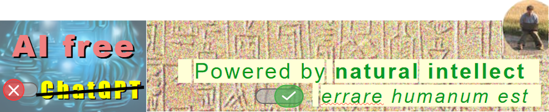

 

# Be&nbsp;kind, solve <code><i>true</i> ==</code> [**READ&thinsp;⊃&thinsp;Write**](https://github.com/Kyriosity/read-write/blob/main/.github/README.md) <b>`||`</b> [**USE&thinsp;⊃&thinsp;Develop**](https://github.com/Kyriosity/use-dev/blob/main/.github/README.md)`;`

